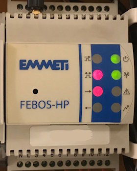
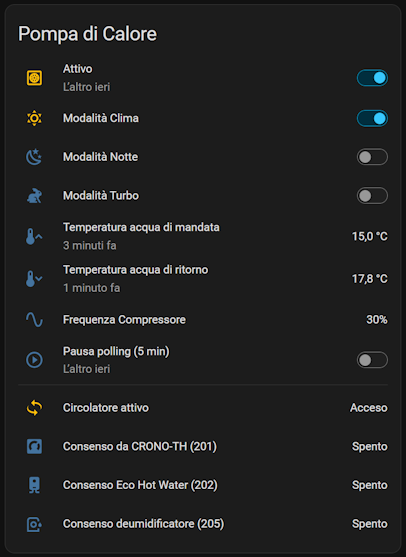
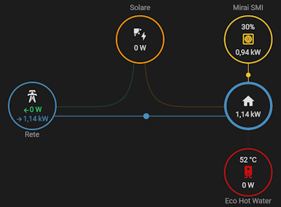

# Emmeti FEBOS-HP Home Assistant Integration

Home Assistant custom integration for the Emmeti FEBOS-HP energy monitoring and heat pump management system.


## Disclaimer

This project is an independent, community-developed Home Assistant integration.

This project is not endorsed by, directly affiliated with, maintained, authorized, or sponsored by 4-noks, EMMETI, or any related company. All product names, trademarks, and registered trademarks are the property of their respective owners.

This software is provided for educational and interoperability purposes only.

By installing and using this integration, you acknowledge that it communicates directly with the FEBOS-HP device and may read and modify configuration parameters of the connected system. Incorrect configuration, software defects, communication errors, hardware incompatibilities, or unforeseen circumstances may result in service interruptions, equipment malfunction, loss of data, reduced performance, increased energy consumption, or physical damage to devices or property.

Use this software entirely at your own risk. Always verify any configuration changes before applying them to a production system.

The author(s) and contributor(s) assume no responsibility or liability for any direct, indirect, incidental, consequential, special, exemplary, or punitive damages, including but not limited to equipment damage, property damage, financial loss, loss of data, system downtime, or personal injury arising from the use of this software.

If you are not comfortable accepting these risks, do not install or use this integration.


## Introduction

HA Custom Component for interoperability with the FEBOS-HP device by [EMMETI](https://emmeti.com/).  
This is typically associated with a MIRAI-SMI heat pump and, optionally, an ECO HOT WATER DHW system.  
Tested personally on my FEBOS-HP device with the above configuration and a 3 kWp photovoltaic system.



I have been looking for a way to integrate this system into Home Assistant for a long time.  
Recently, due to issues with the official application, I tried again. I started by port-scanning the device IP and found that it exposes port 5001. I tried communicating with it via PuTTY, with little success.  

So I decided to look inside the Android application, where I found references to "Elios4You". I then searched the internet and discovered [a very similar device](https://www.4-noks.com/product-categories/solar-photovoltaic-en/elios4you-en/?lang=en) by 4-noks.

I later found that an integration already existed for that device, [ha-4noks-elios4you](https://github.com/alexdelprete/ha-4noks-elios4you) by @alexdelprete, itself based on an article by Davide Vertuani, who reverse-engineered how the official mobile app communicates with the device to fetch data.

If I'm not mistaken, Elios4You only exposes data, except for the possibility to control a relay, while the FEBOS-HP also allows you to manage the heat pump and DHW system.

I tried the integration above and was immediately able to connect to my device.
So I forked the repo and started adding support for reading data not present in Elios4You, as well as writing data to the bus in order to change heat pump configuration.




---

> **Note**
>
> Most of the information that follows is taken from the original repository.  
> Any additional notes, modifications, or observations specific to this fork are explicitly marked as _**(note by @teejay-87)**_.

---

### Features

- Installation/Configuration through Config Flow UI
- Sensor entities for all data provided by the device (I don't even know what some of the ones
  in the diagnostic category specifically represent)
- Switch entity to control the device internal relay
- Configuration options: Name, hostname, tcp port, polling period
- Options flow: change polling period at runtime without restart
- Reconfigure flow: change connection settings (name, host, port) with automatic reload
- Repair notifications: connection issues are surfaced in Home Assistant's repair system
- Enhanced recovery notifications: detailed timing info (downtime, script execution) with persistent acknowledgment
- Device triggers: automate based on device connection events (unreachable, not responding, recovered)
- Diagnostics: downloadable diagnostics file for troubleshooting

### Technical Architecture

The integration is split into two layers that talk to the device via `telnetlib3`:

- **`api.py`** — a thin protocol/parser. It formats the `@dat` / `@sta` / `@inf` / `@rel`
  commands, parses the responses, and exposes the data that backs every sensor.
- **`connection_manager.py`** — owns the single TCP connection to the device, serialises every
  command, and decides when to reconnect, retry, abort, or back off.

The split exists because the FebosHP's embedded TCP stack has very few socket slots and
becomes unresponsive ("deaf") if it's hammered with reconnects. The `ConnectionManager` enforces
gentle behaviour through an explicit state machine
(`DISCONNECTED → CONNECTING → READY → BACKOFF`, terminal `CLOSED` on unload):

- **Async I/O** — every operation yields to the Home Assistant event loop; no blocking calls
- **Connection reuse** — the same TCP session is kept open for up to 90 s, so the default 60 s
  poll cadence usually shares one socket instead of opening a new one each time
- **Single retry** on transient command failures (silent timeout, mid-command transport error);
  the manager closes the failed socket with **TCP RST** (`transport.abort()`) so the device frees
  its slot immediately instead of waiting out CLOSE_WAIT
- **Bounded close** — `wait_closed()` is capped so a misbehaving device cannot hang the integration
- **Exponential backoff** after 3 consecutive failures (5 s → 60 s). While in backoff, the
  manager refuses to even attempt a new connection, giving the device a chance to recover
- **Serialised access** — a single `asyncio.Lock` means polls and switch commands never race
- **Structured logging** — every state transition and connection event is logged with the
  `(ConnMgr.*)` prefix (see Troubleshooting below)
- **Diagnostic sensors** — 12 metrics (state, consecutive failures, silent timeouts, forced
  aborts, reuse hits, etc.) are exposed as opt-in sensors under the device's Diagnostic
  section so you can watch what the manager is doing without enabling debug logs

### Known Limitations

- **Single device per integration instance**: Each FebosHP device requires a separate
  integration instance. To monitor multiple devices, add the integration multiple times.

  _**(note by @teejay-87)**_  
  Due to the reasons above, the connection in indirect mode to the FEBOS-HP is inhibited while the integration is active (the connection through 4-cloud still works). For this reason, I have added a pause switch that temporarily disconnects the integration from the device, so you can still use the official app.


## Installation

### HACS (Recommended)

1. Open HACS in your Home Assistant instance
1. Click on "Integrations"
1. Click the three dots menu in the top right corner
1. Select "Custom repositories"
1. Add `https://github.com/teejay-87/ha-emmeti-feboshp` as an Integration
1. Click "Download" and install the integration
1. Restart Home Assistant

### Manual Installation

1. Download the [repo code](https://github.com/teejay-87/ha-emmeti-feboshp/archive/refs/heads/main.zip)
1. Extract the `custom_components/ha-emmeti-feboshp` folder
1. Copy it to your Home Assistant `config/custom_components/` directory
1. Restart Home Assistant


## Configuration

Configuration is done via config flow right after adding the integration. The integration
provides two ways to modify settings after initial setup:

### Options Flow (Configure button)

Change runtime options without restarting Home Assistant:

| Option | Description | Default |
|--------|-------------|---------|
| **Recovery script** | Script to run when device stops responding. See Recovery Script below | None |
| **Enable repair notifications** | Show persistent notifications when device recovers from failures | Enabled |
| **Failures before notification** | Number of consecutive failures before triggering repair notification (1-10) | 3 |
| **Polling period** | Frequency in seconds to read data and update sensors (30-600) | 60 |

#### Recovery Script

You can configure a script that automatically runs when the device becomes unreachable.

_**(note by @teejay-87)**_  
Note that communication with the FEBOS-HP appears to be quite stable, and I have also made some changes in the stack to ensure connection recovery. I have been using it for several days and have experienced no issues so far.
However, if your experience is different, please let me know, and refer to the original repository’s [related section](https://github.com/alexdelprete/ha-4noks-elios4you#recovery-script).

### Reconfigure Flow (3-dot menu > Reconfigure)

Change connection settings - the integration will automatically reload:

- **Custom name**: custom name for the device, used as prefix for sensors created by the component
- **IP/hostname**: IP/hostname of the device - this is used as unique_id, if you change it
  you will lose historical data (tip: use hostname so you can change IP without losing data)
- **TCP port**: TCP port of the device. tcp/5001 is the only known working port, but left configurable


## Sensor view


## Device Triggers

The integration provides device triggers that allow you to create automations based on device
connection events. These triggers fire when the FEBOS-HP device experiences connectivity
issues or recovers from them.

_**(note by @teejay-87)**_  
Again, I do not expect you to encounter major connection problems.
If you do, please let me know, and refer to the original repository’s [related section](https://github.com/alexdelprete/ha-4noks-elios4you#device-triggers).

## Automation Examples

Here are some practical automation examples using the FEBOS-HP sensors.

### Solar Production Alert

Get notified when your solar panels start producing energy in the morning:

```yaml
automation:
  - alias: "Solar Production Started"
    trigger:
      - platform: numeric_state
        entity_id: sensor.feboshp_produced_power
        above: 0.1
    condition:
      - condition: sun
        after: sunrise
    action:
      - service: notify.mobile_app
        data:
          title: "Solar Production"
          message: "Solar panels are now producing {{ states('sensor.feboshp_produced_power') }} kW"
```

### High Power Consumption Warning

Alert when power consumption exceeds a threshold:

```yaml
automation:
  - alias: "High Power Consumption Alert"
    trigger:
      - platform: numeric_state
        entity_id: sensor.feboshp_consumed_power
        above: 5.0
        for:
          minutes: 5
    action:
      - service: notify.mobile_app
        data:
          title: "High Power Usage"
          message: "Power consumption is {{ states('sensor.feboshp_consumed_power') }} kW for 5 minutes"
```

### Energy Dashboard Integration

Add sensors to the Home Assistant Energy Dashboard:

1. Go to **Settings > Dashboards > Energy**
2. Under "Solar Panels", add `sensor.feboshp_produced_energy`
3. Under "Grid consumption", add `sensor.feboshp_bought_energy`
4. Under "Return to grid", add `sensor.feboshp_sold_energy`

### Daily Energy Summary

Send a daily summary of energy production and consumption:

```yaml
automation:
  - alias: "Daily Energy Summary"
    trigger:
      - platform: time
        at: "21:00:00"
    action:
      - service: notify.mobile_app
        data:
          title: "Daily Energy Report"
          message: >
            Today's peak: {{ states('sensor.feboshp_daily_peak') }} kW
            Self-consumption: {{ states('sensor.feboshp_self_consumed_power') }} kW
```

### Relay Control Based on Production

Automatically enable the relay when solar production exceeds consumption:

```yaml
automation:
  - alias: "Enable Relay on Excess Solar"
    trigger:
      - platform: template
        value_template: >
          {{ states('sensor.feboshp_produced_power') | float >
             states('sensor.feboshp_consumed_power') | float + 1.0 }}
    action:
      - service: switch.turn_on
        target:
          entity_id: switch.feboshp_relay

  - alias: "Disable Relay on Low Solar"
    trigger:
      - platform: template
        value_template: >
          {{ states('sensor.feboshp_produced_power') | float <
             states('sensor.feboshp_consumed_power') | float }}
    action:
      - service: switch.turn_off
        target:
          entity_id: switch.feboshp_relay
```

## Troubleshooting

_**(note by @teejay-87)**_  
Please refer to the original repository’s [related section](https://github.com/alexdelprete/ha-4noks-elios4you#troubleshooting).

## Development

_**(note by @teejay-87)**_  
Please refer to the original repository’s [related section](https://github.com/alexdelprete/ha-4noks-elios4you#development).


## Contributing

Contributions are welcome! Please follow these steps:

1. Fork the repository
1. Create a feature branch (`git checkout -b feature/my-feature`)
1. Make your changes
1. Run linting: `uvx pre-commit run --all-files`
1. Commit your changes (`git commit -m "feat: add my feature"`)
1. Push to your branch (`git push origin feature/my-feature`)
1. Open a Pull Request


## License

This project is licensed under the MIT License - see the [LICENSE](LICENSE) file for details.
